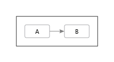
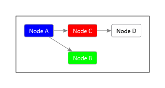

<!-- 
SPDX-FileCopyrightText: (c) 2022-2023 T. Graf
SPDX-License-Identifier: Apache-2.0
-->
# Tethys.Dgml


[](https://ci.appveyor.com/project/tngraf/tethys-dgml)
[](https://www.nuget.org/packages/Tethys.Dgml/1.1.0)
[](https://api.reuse.software/info/git.fsfe.org/reuse/api)

[Directed Graph Markup Language (DGML)](https://github.com/MicrosoftDocs/visualstudio-docs/blob/main/docs/modeling/directed-graph-markup-language-dgml-reference.md)
is a great way to depict dependency graphs.

This small library offers a basic DGML support for .Net.

## Get Package

You can get Tethys.Dgml by grabbing the latest NuGet packages from [here](https://www.nuget.org/packages/Tethys.Xml/1.1.0).

## How to use Tethys.Dgml

### Very simple demo

Let's create a very simple dependency diagram.
Use the following code:

```code
var settings = new OutputSettings();
settings.GraphDirection = GraphDirection.LeftToRight;
var builder = new DgmlBuilder(settings);

builder.Nodes.Add(new Node("A", "A", null));
builder.Nodes.Add(new Node("B", "B", null));

builder.Links.Add(new Link("A", "B"));

builder.WriteToFile("VerySimpleExample.dgml");
```

This will create the following DGML file:

```code
<?xml version="1.0" encoding="utf-8"?>
<DirectedGraph Layout="Sugiyama" GraphDirection="LeftToRight" xmlns="http://schemas.microsoft.com/vs/2009/dgml">
  <Nodes>
    <Node Id="A" Label="A" />
    <Node Id="B" Label="B" />
  </Nodes>
  <Categories />
  <Links>
    <Link Source="A" Target="B" />
  </Links>
</DirectedGraph>
```

If you drop this file on Visual Studio **and** you have the DGML Editor component installed,
you will get the following display:



### Using Categories

If you want the have the nodes in different colors, use the following code:

```code
var settings = new OutputSettings();
settings.GraphDirection = GraphDirection.LeftToRight;
var builder = new DgmlBuilder(settings);

builder.Categories.Add(new Category("Blue", "Blue", "#0000FF"));
builder.Categories.Add(new Category("Green", "Green", "#00FF00"));
builder.Categories.Add(new Category("Red", "Red", "#FF0000"));

builder.Nodes.Add(new Node("A", "Node A", "Blue"));
builder.Nodes.Add(new Node("B", "Node B", "Green"));
builder.Nodes.Add(new Node("C", "Node C", "Red"));
builder.Nodes.Add(new Node("D", "Node D", null));

builder.Links.Add(new Link("A", "B"));
builder.Links.Add(new Link("A", "C"));
builder.Links.Add(new Link("C", "D"));

builder.WriteToFile("CategoriesExample.dgml");
```

The resulting image will look like this:



## Build

### Requisites

* Visual Studio 2019

### Build Solution

Just use the basic `dotnet` command:

```shell
dotnet build
```

Run the demo application:

```shell
dotnet run --project .\Tethys.Dgml.Demo\Tethys.Dgml.Demo.csproj
```

## License

Tethys.Dgml is licensed under the Apache License, Version 2.0.
